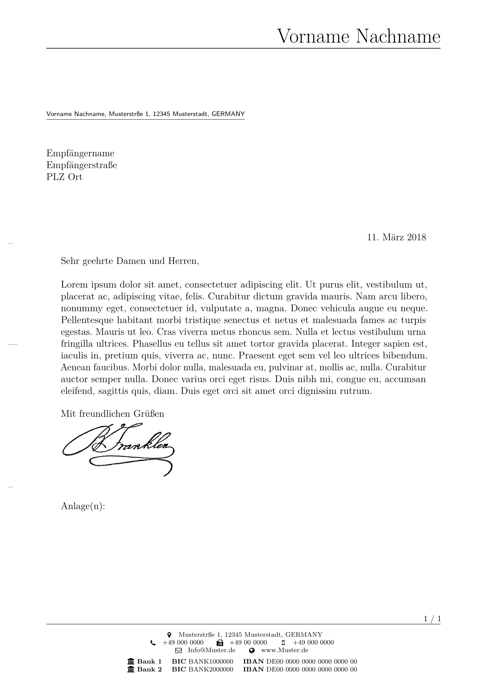

# LaTeX-letter
A LaTeX letter template that uses the `scrlttr2` class of the popular [KOMA-Script](https://www.komascript.de/).

## Example
To get an impression of the letter's design and layout please see the picture below or take a look at the [`example.pdf`](./example/example.pdf).

## Usage
The letter template basically consists of three `TeX` files:

| file          | description                                                                                                               |
| ----          | -----------                                                                                                               |
| `main.tex`    | This is the main file containing basic settings, package usages and the letter's text itself.                             |
| `macros.tex`  | This file comprises typographic and layout customization as well as macros for the header, footer and location fields.    |
| `sender.lco`  | The sender information are stored in this separate file for reasons of modularity.                                        |

### General Note
Please refer to the [KOMA guide](https://www.ctan.org/pkg/scrlttr2) for a comprehensive description of the KOMA variables used.

### `main.tex`
The sender information are included via the `\LoadLetterOption{}` command which loads an `.lco` file. To do so, you must specify the file name of the `.lco` file without suffix as command parameter.

## Acknowledgments
* Thanks to Markus Kohm for his great [KOMA-Script](https://www.komascript.de/) classes for LaTeX.