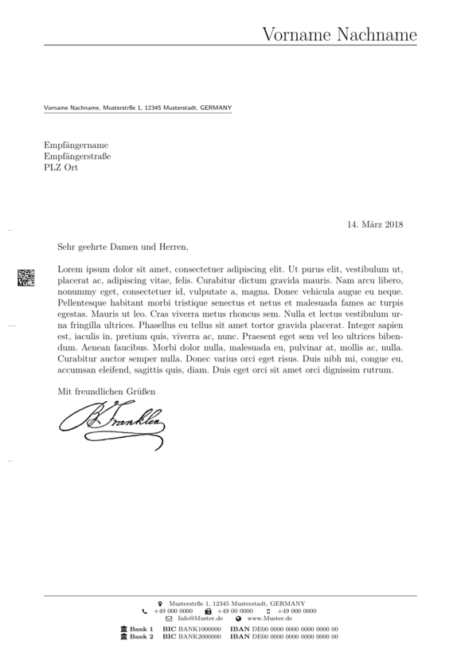

# LaTeX-letter
A LaTeX letter template that uses the `scrlttr2` class of the popular [KOMA-Script](https://www.komascript.de/).

## Example
To get an impression of the letter's design and layout please see the picture below or take a look at the [`example.pdf`](./example/example.pdf).

## Usage
The letter template basically consists of three user-relevant `TeX` files:

| file          | description                                                                                                               |
| ----          | -----------                                                                                                               |
| `main.tex`    | This is the main file containing basic settings, package usages and the letter's text itself.                             |
| `sender.lco`  | The sender information are stored in this separate file for reasons of modularity.                                        |
| `macros.tex`  | This file comprises typographic and layout customization as well as macros for the header, footer and location fields.    |

### General Note
Please refer to the [KOMA guide](https://www.ctan.org/pkg/scrlttr2) for a comprehensive description of the KOMA variables used.

### `main.tex`
The sender information are included via the `\LoadLetterOption{}` command which loads an `.lco` file. To do so, you must specify the file name of the `.lco` file without suffix as command parameter.

### `sender.lco`
This is the file where the sender information are stored. Most (or all) standard sender attributes for the `scrlttr2` class should be stated in there; so it's pretty straightforward to fill in the blanks (or better to say: to modify the already defined variables).

### `macros.tex`
As mentioned before, this file applies specific typographic and layout customization to the letter template. Usually, there is no necessity to adapt this file. However, if one wants to adjust these basic settings, this is the place to do so.

## Acknowledgments
* Thanks to Markus Kohm for his great [KOMA-Script](https://www.komascript.de/) classes for LaTeX.
* Thanks to [Enrico Gregorio](https://github.com/eg9) for the [UUID v4 generator snippet](https://tex.stackexchange.com/questions/332329/how-can-one-create-a-random-guid).